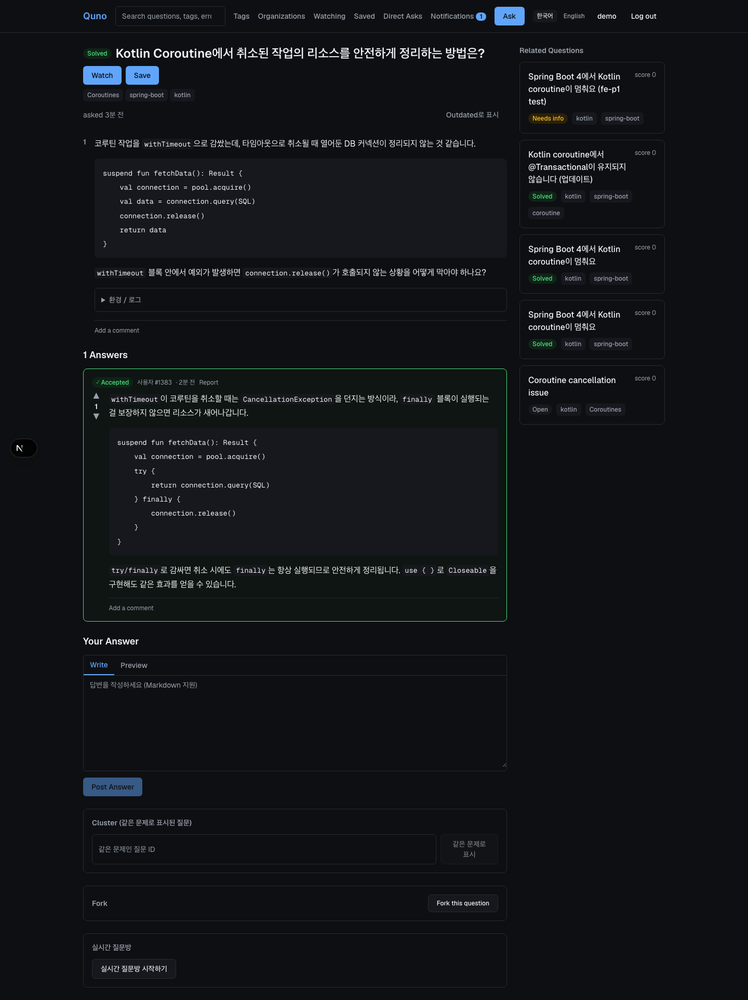
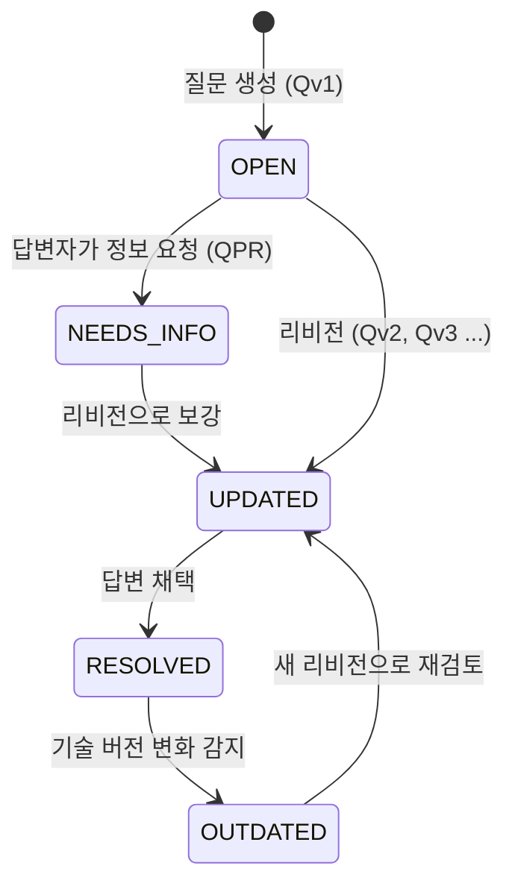
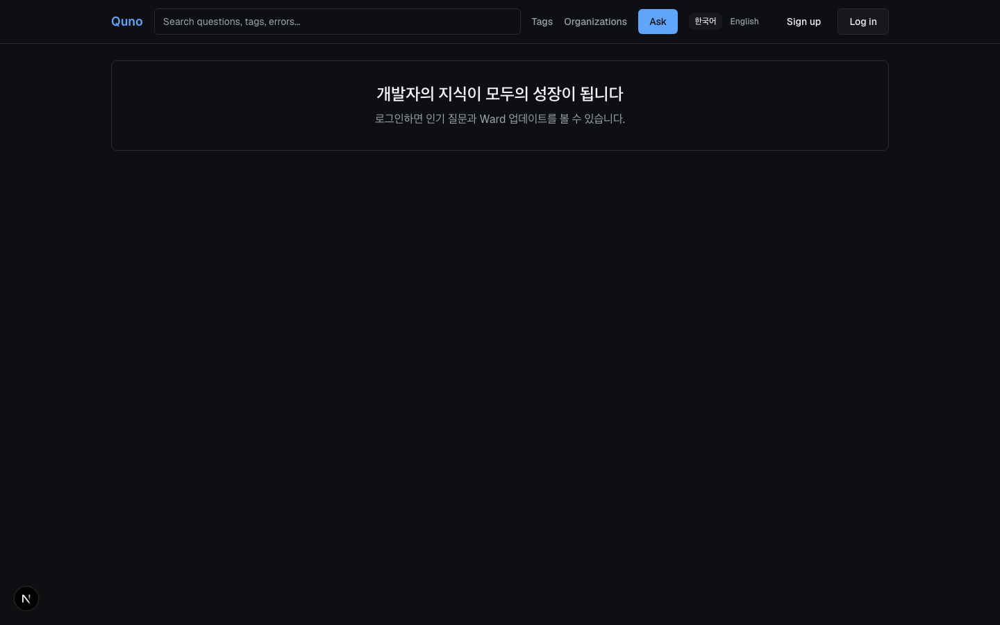
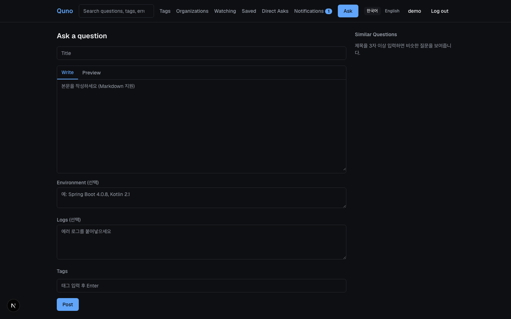
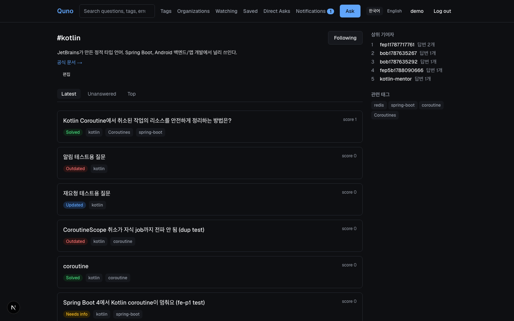
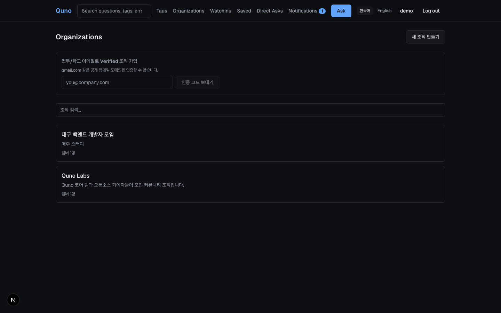
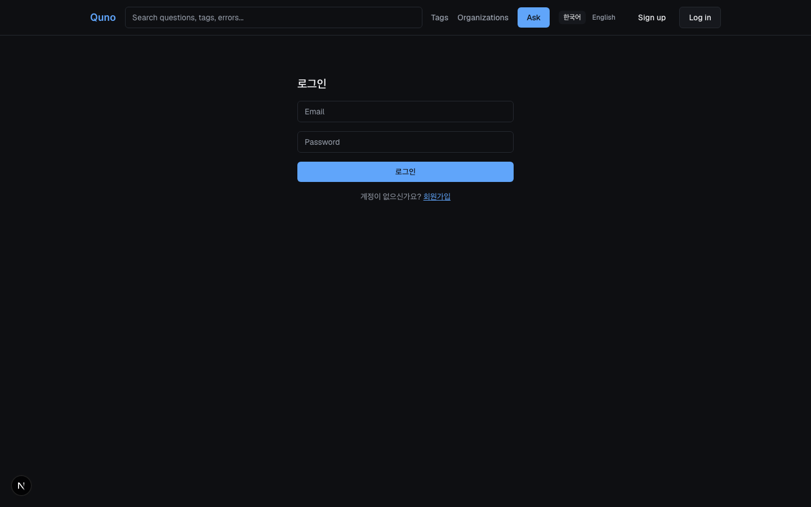
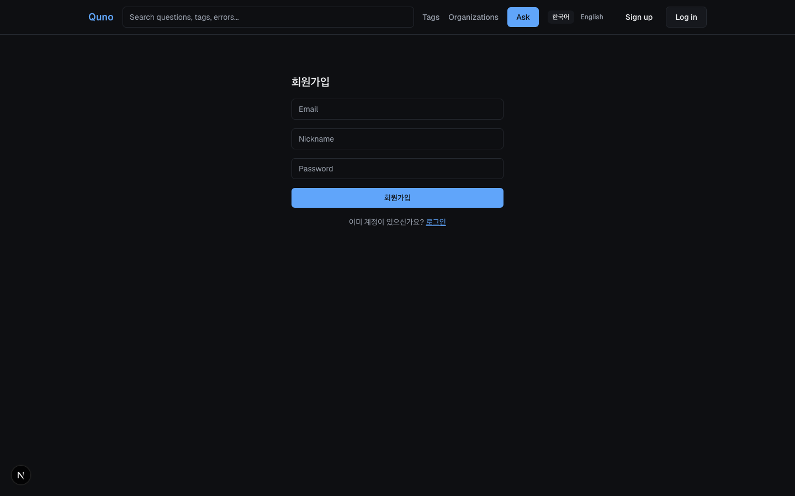
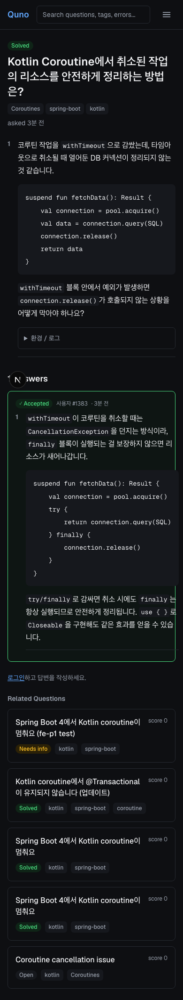
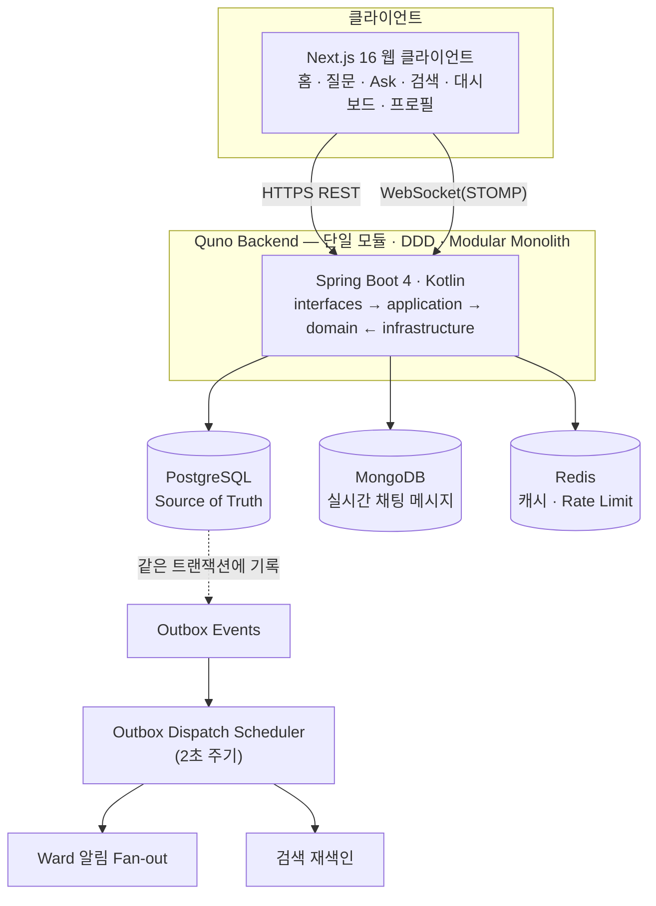

# Quno

**Living Questions. Growing Knowledge.**

Quno는 소프트웨어 개발 질문을 한 번 쓰고 버려지는 게시물이 아니라, **버전 관리되고 연결되고 병합되며 계속 진화하는 살아있는 지식 객체(Living Question Card)**로 다루는 개발자 Q&A 플랫폼입니다.

<p>
  
  
  
  
  
  
</p>



## 목차

- [Quno가 다른 점](#quno가-다른-점)
- [핵심 개념 — Living Question Card](#핵심-개념--living-question-card)
- [화면 둘러보기](#화면-둘러보기)
- [기능](#기능)
- [기술 스택](#기술-스택)
- [아키텍처](#아키텍처)
- [빠른 시작](#빠른-시작)
- [프로젝트 구조](#프로젝트-구조)
- [테스트 · 품질](#테스트--품질)
- [문서 지도](#문서-지도)
- [프로젝트 현황](#프로젝트-현황)
- [기여하기](#기여하기)

## Quno가 다른 점

기존 Q&A 서비스의 데이터 모델은 `Question → Answers → Accepted Answer`에서 멈춥니다. 채택되고 나면 질문은 사실상 죽은 게시물이 됩니다. Quno는 여기서 한 걸음 더 나갑니다.

| 기존 Q&A의 한계 | Quno의 접근 |
|---|---|
| 기술 버전이 바뀌어도 과거 답변이 그대로 남는다 | 질문 리비전(Qv1 → Qv2 → ...)과 Diff로 변화 과정을 보존 |
| 질문 수정 시 과거 맥락이 사라진다 | 버전마다 append-only로 이력을 남기고 답변은 특정 버전을 타겟으로 명시 |
| 유사 질문이 고립되거나 중복으로 단순 삭제된다 | 중복을 "문제가 중요하다는 신호"로 보고 Cluster → Super Answer로 발전 |
| 해결 후 다시 방문할 이유가 약하다 | Ward(구독), 개인화 대시보드, Quno Flow 활동 피드 제공 |

> 자세한 제품 철학은 [docs/product/vision.md](docs/product/vision.md)에 정리되어 있습니다.

## 핵심 개념 — Living Question Card



`RESOLVED`는 질문의 죽음이 아니라 "현재 조건에서 해결됨"을 뜻하는 하나의 상태일 뿐입니다. 유사한 질문들은 **Cluster**로 묶여 대표 해결책(**Super Answer**)으로 수렴하고, 특정 환경에 맞게 **Fork**될 수도 있습니다.

## 화면 둘러보기

<table>
<tr>
<td width="50%">

**홈 (비로그인)**


</td>
<td width="50%">

**질문 작성 — 유사 질문 실시간 추천**


</td>
</tr>
<tr>
<td width="50%">

**태그 상세 — 위키형 설명 편집, 기여자 랭킹**


</td>
<td width="50%">

**조직(Organization)**


</td>
</tr>
</table>

<details>
<summary>더 보기 — 로그인/회원가입, 모바일 반응형</summary>
<br>

<table>
<tr>
<td width="33%"></td>
<td width="33%"></td>
<td width="33%"></td>
</tr>
</table>

</details>

## 기능

| 영역 | 내용 |
|---|---|
| **질문 리비전** | 질문을 append-only 버전으로 관리, 버전 간 Diff 제공 |
| **QPR (Question Pull Request)** | 답변자가 추가 정보를 요청하고(Review), 작성자가 리비전 후 재요청하는 협업 플로우 |
| **Ward** | 질문 구독 — 새 리비전/답변/채택/재요청 시 알림 |
| **Cluster / Super Answer / Fork** | 중복·유사 질문을 클러스터로 묶고, 대표 해결책을 지정하거나 특정 조건으로 포크 |
| **투표 · 댓글 · 저장 · 배지** | 질문/답변 투표, 1단계 대댓글, 나중에 보기, 활동 기반 배지 |
| **검색 · 추천** | PostgreSQL 전문 검색 + 태그 매칭 기반 관련 질문 추천 |
| **대시보드 · Quno Flow** | 인기 질문, 관심 태그 피드, 재활성화된 지식을 모은 개인화 피드 |
| **Organization** | 회사/커뮤니티 조직 생성, 업무 이메일 도메인 인증(Verified) |
| **Direct Ask** | 특정 사용자에게 유료 질문 요청(Toss Payments 연동) |
| **실시간 질문방** | 질문별 WebSocket(STOMP) 채팅방, 접속자 수 표시 |
| **모더레이션** | 신고 접수 및 Keep/Hide 처리 |
| **다국어(i18n)** | 핵심 플로우(홈/로그인/회원가입/질문 작성) 한국어/영어 지원 |
| **접근성** | axe-core 자동 검사, 키보드 전용 플로우 E2E, WCAG AA 명도 대비 |

각 기능의 설계 배경과 트레이드오프는 [ADR 목록](docs/architecture/decisions/README.md)에 결정별로 기록되어 있습니다.

## 기술 스택

| 영역 | 선택 |
|---|---|
| **백엔드 언어/프레임워크** | Kotlin 2.2.21, Spring Boot 4.0.8, Java 21 |
| **아키텍처** | 단일 모듈 · DDD · Modular Monolith (`domain` / `application` / `interfaces` / `infrastructure`) |
| **빌드** | Gradle Kotlin DSL |
| **DB** | PostgreSQL(Source of Truth, Flyway 마이그레이션) · MongoDB(실시간 채팅 메시지) · Redis(캐시 · Rate Limit) |
| **인증** | JWT(Access/Refresh, Stateless), Spring Security |
| **실시간** | WebSocket(STOMP) |
| **결제** | Toss Payments (Direct Ask) |
| **관측성** | 구조화 로깅(ECS), Prometheus 메트릭, Sentry 에러 트래킹 |
| **프론트엔드** | Next.js 16(App Router, Turbopack), React 19, TypeScript |
| **상태/데이터** | TanStack Query, React Hook Form + Zod |
| **스타일** | Tailwind CSS 4 |
| **테스트** | JUnit5/MockMvc(백엔드), Vitest + Testing Library + Playwright(프론트엔드) |
| **CI** | GitHub Actions (백엔드/프론트엔드/E2E 3개 잡) |

기술 선택 근거는 [ADR-0001](docs/architecture/decisions/0001-tech-stack.md)과 [system-architecture.md](docs/architecture/system-architecture.md)에 정리되어 있습니다.

## 아키텍처



- **모듈형 모놀리스**: 배포 복잡도를 낮추면서도 `domain`(엔티티·정책) → `application`(유스케이스·트랜잭션) → `interfaces`(Controller/DTO), `infrastructure`(JPA/Mongo/Redis 어댑터)로 패키지 레벨 경계를 명확히 유지합니다.
- **Transactional Outbox**: 리비전/답변/채택 같은 도메인 변경과 이벤트 기록을 한 트랜잭션에 묶어 dual-write 문제를 피하고, 스케줄러가 이를 소비해 알림과 검색 색인을 갱신합니다.
- 상세 설계는 [system-architecture.md](docs/architecture/system-architecture.md)(패키지 구조·계층 규칙), [domain-model.md](docs/architecture/domain-model.md)(ERD·SQL 흐름), [api-design.md](docs/architecture/api-design.md)(엔드포인트 설계)를 참고하세요.

## 빠른 시작

### 사전 요구사항

- [Docker Desktop](https://www.docker.com/products/docker-desktop/) (PostgreSQL/MongoDB/Redis/Mailpit 실행용)
- JDK 21
- Node.js 22+

### 한 번에 실행

저장소 루트의 [run.sh](run.sh) 하나로 인프라 기동부터 백엔드/프론트엔드 서버 실행까지 처리합니다.

```bash
./run.sh
```

Docker가 꺼져 있으면 자동으로 켜고 기동을 기다린 뒤, PostgreSQL/MongoDB/Redis/Mailpit 컨테이너를 올리고 백엔드(`local` 프로필)와 프론트엔드 개발 서버를 함께 띄웁니다.

- 프론트엔드: http://localhost:3000
- 백엔드 API: http://localhost:8081 (상태 확인: `/actuator/health`)
- API 문서(Swagger UI): http://localhost:8081/swagger-ui.html
- Mailpit(로컬 메일 확인용): http://localhost:8026

종료는 `Ctrl+C` 한 번이면 됩니다.

### 개별 실행

```bash
# 인프라만
docker compose up -d

# 백엔드
cd backend && SPRING_PROFILES_ACTIVE=local ./gradlew bootRun

# 프론트엔드
cd frontend && npm install && npm run dev
```

운영 배포에 필요한 환경변수는 [.env.example](.env.example)을 참고하세요. 로컬 개발에는 필요하지 않습니다.

## 프로젝트 구조

```text
quno/
├── backend/                        # Kotlin + Spring Boot 4 (단일 모듈 DDD)
│   └── src/main/kotlin/com/quno/qunobackend/
│       ├── domain/                 # 엔티티 · 값 객체 · 도메인 정책
│       ├── application/            # 유스케이스 · 트랜잭션 경계
│       ├── interfaces/api/         # Controller · DTO
│       └── infrastructure/         # JPA/Mongo/Redis/Security 어댑터
├── frontend/                       # Next.js 16 (App Router) + React 19
│   └── src/
│       ├── app/                    # 라우트
│       ├── features/               # 기능 단위 UI + 훅 + API 클라이언트
│       ├── entities/                # 도메인 모델 공용 타입/훅
│       ├── widgets/                 # 여러 feature를 조합한 화면 단위 위젯
│       └── shared/                  # 공용 UI/유틸/HTTP 클라이언트
├── docs/
│   ├── product/                    # 비전 · MVP 범위 · 상용화/품질 개선 계획
│   ├── architecture/                # 시스템 아키텍처 · 도메인 모델 · API 설계 · ADR
│   ├── frontend/                    # 프론트엔드 UX/디자인 시스템 설계
│   └── operations/                  # 운영 런북
├── scripts/                        # DB 백업/복구, 부하 테스트 스크립트
├── docker-compose.yml              # 로컬 개발 인프라
├── run.sh                          # 로컬 원커맨드 실행 스크립트
└── PLAN.md                         # 전체 개발 진행 기록 (Phase별 작업 로그)
```

## 테스트 · 품질

```bash
# 백엔드 — 단위/통합 테스트 + ktlint
cd backend && ./gradlew test ktlintCheck

# 프론트엔드 — 단위 테스트(+커버리지), lint, 빌드
cd frontend && npm run test:coverage && npm run lint && npm run build

# 프론트엔드 — E2E (백엔드/인프라가 이미 떠 있어야 함)
cd frontend && npm run test:e2e
```

모든 PR과 `main` 푸시는 [GitHub Actions](.github/workflows/ci.yml)에서 백엔드(ktlint + 테스트), 프론트엔드(lint + 테스트 + 빌드), E2E(회원가입 → 질문 작성 → 답변, Playwright) 3개 잡으로 검증됩니다.

- 접근성: `@axe-core/playwright` 기반 자동 검사가 CI에 포함되어 있습니다 ([ADR-0051](docs/architecture/decisions/0051-accessibility-axe-core-e2e.md)).
- 코드 스타일: 백엔드는 ktlint, 프론트엔드는 ESLint로 강제합니다.
- 커버리지는 PR에서 급격한 하락을 눈에 띄게 하는 용도로 아티팩트 업로드만 하며, 실패 조건으로 강제하지 않습니다 ([ADR-0049](docs/architecture/decisions/0049-code-quality-gates-ktlint-jacoco-eslint.md)).

## 문서 지도

이 저장소는 "왜 지금 이 상태인가"를 코드가 아니라 문서에 남기는 것을 원칙으로 합니다. 방향에 따라 아래 문서부터 읽으세요.

| 알고 싶은 것 | 문서 |
|---|---|
| 제품 철학, Living Question Card 개념 | [docs/product/vision.md](docs/product/vision.md) |
| MVP 범위, 로드맵, 성공 지표 | [docs/product/mvp-scope.md](docs/product/mvp-scope.md) |
| 상용화(배포/보안/관측성) 체크리스트 | [docs/product/production-readiness.md](docs/product/production-readiness.md) |
| 성능/접근성/UX/i18n 품질 개선 계획 | [docs/product/quality-improvement-plan.md](docs/product/quality-improvement-plan.md) |
| 시스템 아키텍처, 패키지 구조 | [docs/architecture/system-architecture.md](docs/architecture/system-architecture.md) |
| 도메인 모델, ERD, SQL 흐름 | [docs/architecture/domain-model.md](docs/architecture/domain-model.md) |
| REST API 설계 | [docs/architecture/api-design.md](docs/architecture/api-design.md) |
| **"왜 이렇게 결정했는가" (ADR 53개)** | [docs/architecture/decisions/](docs/architecture/decisions/README.md) |
| **기술적으로 어려웠던 문제와 진단 과정** | [docs/engineering/technical-deep-dives.md](docs/engineering/technical-deep-dives.md) |
| 프론트엔드 UX/디자인 시스템 | [docs/frontend/](docs/frontend/README.md) |
| 운영 런북 | [docs/operations/runbook.md](docs/operations/runbook.md) |
| 전체 개발 진행 기록(Phase별) | [PLAN.md](PLAN.md) |

## 프로젝트 현황

MVP(질문 리비전·Ward·QPR·검색·추천)부터 상용화 준비(배포 파이프라인·보안·관측성·신뢰성), 품질 개선(성능·접근성·i18n·UX·테스트 커버리지)까지 63개 Phase에 걸쳐 진행되어 왔습니다. 진행 방식과 각 단계의 세부 내용은 [PLAN.md](PLAN.md)에서 확인할 수 있습니다.

- **ADR 53건** — 기술 선택/설계 트레이드오프/스코프 결정을 그때그때 기록
- **백엔드 테스트 348개**, **프론트엔드 테스트 325개**(단위) + Playwright E2E(골든 패스/접근성/키보드 전용)
- CI에 ktlint, ESLint, 자동 접근성 검사, E2E 골든 패스 포함

## 기여하기

커밋 컨벤션은 [CONTRIBUTING.md](CONTRIBUTING.md)([Conventional Commits](https://www.conventionalcommits.org/ko/v1.0.0/) 기반)를 따릅니다. 아키텍처적으로 의미 있는 변경에는 ADR을 함께 남겨주세요 ([작성 규칙](docs/architecture/decisions/README.md)).
