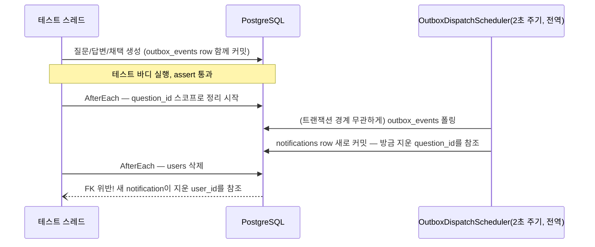

# 기술 딥다이브 — 어려웠던 문제들

이 문서는 ADR([docs/architecture/decisions/](../architecture/decisions/README.md))이 담지 못하는 것을 담는다. ADR은 "왜 이렇게 결정했는가"를 남기지만, 여기 모은 것들은 **결정의 문제가 아니라 진단의 문제**였다 — 겉으로 보이는 증상과 실제 원인이 멀리 떨어져 있어서, 틀린 첫 가설을 반증하고 나서야 진짜 원인에 도달한 사례들이다. 각 항목은 같은 순서로 쓴다: 증상 → 왜 바로 안 보였는가 → 무엇을 시도했고 왜 틀렸는가 → 실제 원인 → 해결 → 검증 방법.

모든 항목은 실제로 발생했고, 실제 코드/로그/테스트로 재현·검증됐다. 자세한 배경은 각 절 끝의 관련 문서를 참고한다.

## 목차

- [I. 동시성 — 눈에 안 보이는 레이스 컨디션](#i-동시성--눈에-안-보이는-레이스-컨디션)
  - [1. Outbox 폴링 스케줄러가 테스트 정리(cleanup)와 경합한다](#1-outbox-폴링-스케줄러가-테스트-정리cleanup와-경합한다)
  - [2. 동시 리비전 생성 — `SELECT ... FOR UPDATE`가 막아야 하는 것](#2-동시-리비전-생성--select--for-update가-막아야-하는-것)
- [II. 프레임워크의 침묵하는 실패](#ii-프레임워크의-침묵하는-실패)
  - [3. STOMP 인증이 매번 씹히는 이유 — detached accessor](#3-stomp-인증이-매번-씹히는-이유--detached-accessor)
  - [4. 결제 요청 바디가 조용히 `{}`가 되는 버그](#4-결제-요청-바디가-조용히-가-되는-버그)
  - [5. MongoDB 설정이 조용히 무시된 사건](#5-mongodb-설정이-조용히-무시된-사건)
- [III. 데이터 정합성 — 순서가 틀리면 나는 엉뚱한 에러](#iii-데이터-정합성--순서가-틀리면-나는-엉뚱한-에러)
  - [6. Soft-delete를 먼저 하면 상태 전이 자체가 증발한다](#6-soft-delete를-먼저-하면-상태-전이-자체가-증발한다)
  - [7. 답변 리비전이 만든 순환 참조 정리 순서](#7-답변-리비전이-만든-순환-참조-정리-순서)
- [IV. 성능 — N+1을 배치로](#iv-성능--n1을-배치로)
  - [8. 검색, 추천, 대시보드가 공유하던 3N개 쿼리](#8-검색-추천-대시보드가-공유하던-3n개-쿼리)
- [V. 툴체인 — 버전 정렬이 이긴다](#v-툴체인--버전-정렬이-이긴다)
  - [9. `.editorconfig` 파일 하나가 174개 파일을 재포맷시킨 이유](#9-editorconfig-파일-하나가-174개-파일을-재포맷시킨-이유)
  - [10. `force()`가 안 먹히는 이유 — Kotlin Gradle Plugin의 정렬 우선순위](#10-force가-안-먹히는-이유--kotlin-gradle-plugin의-정렬-우선순위)
- [VI. 프론트엔드 — 하이드레이션과 번들링](#vi-프론트엔드--하이드레이션과-번들링)
  - [11. `useSyncExternalStore`로 로그인 상태의 하이드레이션 깜빡임을 없앤다](#11-usesyncexternalstore로-로그인-상태의-하이드레이션-깜빡임을-없앤다)
  - [12. "연결은 지연했는데 번들은 안 지연됐다"](#12-연결은-지연했는데-번들은-안-지연됐다)
- [13. 테스트가 잡아낸 unhandled promise rejection](#13-테스트가-잡아낸-unhandled-promise-rejection)

---

## I. 동시성 — 눈에 안 보이는 레이스 컨디션

### 1. Outbox 폴링 스케줄러가 테스트 정리(cleanup)와 경합한다

**증상.** `QuestionClusterLifecycleE2ETest`를 포함한 여러 `*LifecycleE2ETest`가 연속 실행하면 이따금 FK 위반으로 실패했다. 단독 실행하면 통과하고, 재현 조건도 명확하지 않았다 — 전형적인 flaky 테스트 냄새였다.

**왜 바로 안 보였는가.** 이 프로젝트는 리비전·답변·채택 같은 도메인 변경을 [Transactional Outbox](../architecture/system-architecture.md#비동기-이벤트-처리--transactional-outbox) 패턴으로 처리한다. `OutboxDispatchScheduler`는 `@Scheduled(fixedDelay = 2000)`로 2초마다 **전역으로** `outbox_events`를 폴링한다:

```kotlin
@Component
class OutboxDispatchScheduler(
    private val dispatchOutboxEventsUseCase: DispatchOutboxEventsUseCase,
) {
    @Scheduled(fixedDelay = 2000)
    fun dispatch() {
        dispatchOutboxEventsUseCase.execute()
    }
}
```

이 스케줄러는 **테스트 트랜잭션과 완전히 무관하게** 백그라운드에서 계속 돈다. 테스트 하나가 끝나고 `@AfterEach`가 정리 SQL을 실행하는 바로 그 타이밍에, 이전에 테스트가 만든 리비전/답변/채택 이벤트를 이 스케줄러가 마침 소비해 새 `notifications` row를 커밋할 수 있다 — 정리 코드가 이미 실행되고 지나간 자리에.



`Scheduler`의 두 화살표가 실행되는 시점은 매번 달랐다 — 정리가 다 끝난 뒤에 스케줄러가 폴링하면 통과하고, 정리 도중에 끼어들면 위 그림처럼 실패했다. 순서가 매번 바뀌니 재현 조건이 불명확한 flaky 테스트로 보였던 것이다.

**무엇을 놓쳤는가.** 처음엔 `@AfterEach`의 정리 SQL 순서(FK 의존성 역순)만 확인했다 — `question_versions` → `answers` → `questions` 순으로 지우고 있었으니 순서 자체는 맞았다. 하지만 순서가 맞아도, 정리 SQL이 실행되는 **그 순간에 새로운 row가 끼어들면** 아무 순서도 소용없다. "정리 SQL의 순서" 문제가 아니라 "정리 SQL이 끝나는 시점과 스케줄러가 쓰는 시점의 경합" 문제였다.

**실제 원인.** `question_id`를 스코프로 잡고 지우는 정리 코드는, 그 `question_id`로 알림이 "이제 더 안 생긴다"를 보장하지 못한다. 스케줄러가 이미 큐에 들어있던 outbox 이벤트를 정리 직후에 소비하면, 방금 지운 질문을 가리키는 `question_id` 컬럼을 가진 `notifications` row가 새로 생긴다. 그리고 그 뒤에 사용자(`users`)를 지우면, 그 새 알림의 `user_id` FK가 위반된다.

**해결.** `question_id` 스코프 정리 뒤에, 사용자를 지우기 직전 한 번 더 **`user_id` 스코프로** 정리를 추가했다:

```kotlin
// The outbox dispatch scheduler polls independently of this test's transactions, so a
// notification for one of these users can still land after the question_id-scoped
// deletes above ran. Catch it by user_id right before deleting the users themselves.
userIds.forEach { id -> jdbcTemplate.update("DELETE FROM notifications WHERE user_id = ?", id) }
userIds.forEach { id -> jdbcTemplate.update("DELETE FROM users WHERE id = ?", id) }
```

같은 패턴(질문 스코프만 정리하고 사용자를 나중에 지움)을 쓰는 `Comment`/`Question`/`QuestionOutdated`/`QuestionReview`/`ReviseQuestionConcurrency`/`Vote` 6개 E2E 테스트 전부에 동일한 `userIds` 기준 정리를 추가했다 — 하나에서 발견한 레이스는 같은 구조를 쓰는 모든 곳에 있다고 가정하는 게 안전했다.

**검증.** 전체 스위트를 연속 3회 재실행해 안정적으로 통과하는 것을 확인했다. 단발성 재현이 아니라 "이 조건에서 반드시 통과한다"는 확신이 필요했기 때문이다.

**교훈.** 백그라운드 폴러가 있는 시스템에서 테스트 정리 코드를 "이 트랜잭션이 만든 것만 지운다"는 전제로 짜면 안 된다 — 폴러는 트랜잭션 경계를 모른다. 정리는 "이 테스트가 건드린 리소스"가 아니라 "이 테스트가 건드린 리소스 + 그로부터 파생될 수 있는 모든 것"을 스코프로 잡아야 한다.

> 관련: [system-architecture.md — Transactional Outbox](../architecture/system-architecture.md#비동기-이벤트-처리--transactional-outbox), PLAN.md Phase 19.4

### 2. 동시 리비전 생성 — `SELECT ... FOR UPDATE`가 막아야 하는 것

**증상 아닌 증상.** 이건 실제 장애가 아니라, 설계 단계에서 미리 잡은 경쟁 조건이다. 질문 리비전의 버전 번호를 `MAX(version_number) + 1`로 계산하면, 두 사용자가 거의 동시에 같은 질문을 리비전할 때 둘 다 같은 `MAX` 값을 읽고 같은 다음 버전 번호를 계산할 수 있다 — 유니크 제약이 없다면 버전 번호 중복이, 있다면 한쪽이 이유 모를 제약 위반으로 실패한다.

**해결.** 리비전 생성 트랜잭션이 대상 질문 row를 `SELECT ... FOR UPDATE`로 잠근 뒤 `MAX(version_number)`를 계산한다 — 두 번째 트랜잭션은 첫 번째가 커밋할 때까지 그 row에 대한 락을 기다렸다가, 첫 번째가 만든 새 버전을 포함해서 다시 계산한다. `(question_id, version_number)` 유니크 제약을 이중 방어선으로 둔다.

**검증.** 단위 테스트로는 이런 종류의 진짜 동시 접근을 재현할 수 없다 — 인메모리 fake는 애초에 락이라는 개념이 없다. `ReviseQuestionConcurrencyIntegrationTest`가 **8개 스레드로 동일 질문을 동시에 리비전**시켜 실제 PostgreSQL 트랜잭션·락으로 버전 번호 중복/누락이 없는지 확인한다 — 이 프로젝트에서 "동시성 방어가 실제로 동작하는가"를 검증하는 유일하게 확실한 방법은 진짜로 동시에 때려보는 것뿐이었다.

> 관련: PLAN.md Phase 2.3, Phase 2.10

## II. 프레임워크의 침묵하는 실패

세 사례 모두 같은 모양이다: **에러가 나지 않는다.** 잘못된 값이 조용히 기본값으로 대체되거나, 인증이 조용히 다음 프레임에 전달되지 않거나, 요청 바디가 조용히 빈 객체가 된다. 로그만 봐서는 아무것도 잘못되지 않은 것처럼 보인다.

### 3. STOMP 인증이 매번 씹히는 이유 — detached accessor

**증상.** STOMP `CONNECT` 프레임에서 JWT를 검증해 세션의 Principal을 설정했는데, 그 뒤 같은 세션의 `SEND`/`SUBSCRIBE` 프레임에서 `Principal`을 읽으면 매번 `null`이었다. 인증 자체(`tokenProvider.validateAccessToken`)는 예외 없이 통과했다 — 토큰은 유효했다. 다만 그 결과가 아무 데도 반영되지 않았다.

**첫 시도와 그게 틀린 이유.** `ChannelInterceptor.preSend`에서 `StompHeaderAccessor.wrap(message)`로 접근자를 만들어 `.user`를 설정했다. 코드만 보면 완전히 정상이다 — `wrap()`은 공식 API이고 컴파일도 되고 런타임 예외도 없다. 문제는 `wrap()`이 **매번 새로운 접근자 객체를 만든다**는 것이다. 그 객체에 `.user`를 설정해도, 그건 그 객체만의 상태일 뿐 메시지 자체(그리고 그 메시지가 담고 있는, 세션에 실제로 쓰이는 헤더)에는 반영되지 않는다 — 즉 "복사본을 수정하고 원본은 그대로 두는" 전형적인 실수였다.

**실제 원인과 해결.** `MessageHeaderAccessor.getAccessor(message, StompHeaderAccessor::class.java)`를 쓰면, 새 객체를 만드는 대신 **메시지에 이미 내장되어 있는 mutable 접근자**를 그대로 돌려준다. 여기에 `.user`를 설정해야 그 세션의 이후 모든 프레임에서 보인다.

```kotlin
// StompHeaderAccessor.wrap(message) would create a detached copy — mutating that
// wouldn't touch the message actually sent downstream. getAccessor(...) instead returns
// the mutable accessor already embedded in the message, so setting `.user` here is what
// makes it visible to every later frame in this STOMP session.
val accessor = MessageHeaderAccessor.getAccessor(message, StompHeaderAccessor::class.java) ?: return message
if (accessor.command != StompCommand.CONNECT) return message
// ...
accessor.user = UsernamePasswordAuthenticationToken(userId.toString(), null, emptyList())
```

**왜 이걸 찾기 어려웠는가.** WebSocket은 curl로 찔러볼 수 없다. 이 버그를 재현하려면 실제 STOMP 프로토콜 왕복(CONNECT → SUBSCRIBE → SEND)이 필요했는데, 이 프로젝트는 이때 처음으로 Python `websockets` 라이브러리로 STOMP 프레임을 수동 구성하는 검증 스크립트를 작성했다. `wrap()`과 `getAccessor()`는 시그니처도 비슷하고 둘 다 "정상적인" Spring Messaging API라, 코드 리뷰만으로는 차이가 잘 안 보인다 — 실제 프로토콜로 끝까지 왕복시켜야만 드러나는 종류의 버그였다.

**검증.** CONNECT 인증 → presence 구독/카운트 브로드캐스트 → 메시지 전송/실시간 수신 → 연결 종료 시 카운트 감소까지 전 구간을 실제 STOMP 프로토콜로 확인했다.

> 관련: [ADR-0036](../architecture/decisions/0036-live-chat-websocket-mongodb-redis-presence.md), PLAN.md Phase 24.4

### 4. 결제 요청 바디가 조용히 `{}`가 되는 버그

**증상.** 토스페이먼츠 결제 확인 API를 호출하는 `TossPaymentGateway`가 로컬 모크 서버에 요청을 보내면, 서버가 받은 바디가 항상 빈 `{}`였다. 예외는 전혀 없었다 — 요청은 "성공"했다.

**첫 진단과 그게 틀린 이유.** 요청/응답 DTO가 `TossPaymentGateway` 내부의 `private data class`(nested)로 선언돼 있어서, Jackson이 리플렉션으로 접근하지 못하는 것으로 추정했다. 파일 최상위로 옮겼다 — 재현은 그대로였다. 첫 가설은 틀렸다.

**실제 원인.** `RestClient.builder()` **정적 팩토리**로 만든 클라이언트는 Spring Boot의 메시지 컨버터 자동구성(이 프로젝트가 쓰는 Jackson 3 `tools.jackson` 컨버터 포함)을 거치지 않는다. Spring Boot가 자동구성한 `RestClient.Builder` 빈을 주입받는 표준 해법을 시도했지만, 이 프로젝트가 쓰는 세분화된 스타터(`spring-boot-starter-webmvc`)로는 그 빈 자체가 등록되지 않아(`RestClientAutoConfiguration` 미발동) 기동조차 안 됐다.

흥미로운 점: 같은 정적 `RestClient.builder()`를 쓰는 [`EndOfLifeDateTechnologyReleaseFeed`](../architecture/decisions/0033-technology-version-scan-detection-only-no-auto-outdated.md)는 실제로 잘 동작하고 있었다 — 이건 GET 응답 파싱만 하고 요청 바디를 안 보낸다. 즉 이 프로젝트의 정적 `RestClient.builder()`는 **응답 디코딩은 되지만 요청 바디 인코딩은 안 되는 비대칭적 함정**이었다.

**해결.** 컨버터 자동 선택에 기대지 않고, 이미 코드베이스 곳곳에서 검증된 `ObjectMapper` 빈을 직접 주입받아 `writeValueAsString`/`readValue`로 수동 직렬화하고, `RestClient`에는 순수 문자열만 오가게 했다.

**어떻게 잡았는가.** 실제 토스 서버에 결제 정보를 보낼 수는 없으니(카드 정보 입력은 예외 없이 지켜야 할 원칙이었다), 로컬 Python HTTP 서버로 만든 모크에 `quno.toss.api-base-url`을 임시로 돌려서 실제 아웃바운드 요청의 **바이트 단위 내용**을 직접 눈으로 확인했다. 단위 테스트(`FakePaymentGateway`)만으로는 이 버그가 원천적으로 안 보인다 — 게이트웨이 자체를 가짜로 대체하니까. HTTP 레이어까지 내려가서 실제로 무엇이 나가는지 봐야 했다.

> 관련: [ADR-0037](../architecture/decisions/0037-paid-direct-ask-toss-payments-test-mode.md), PLAN.md Phase 25.3

### 5. MongoDB 설정이 조용히 무시된 사건

**증상.** Live Chat 메시지를 MongoDB에 저장하도록 구현하고 실제로 채팅을 보냈는데, 애플리케이션 로그에는 아무 이상이 없었다. 그런데 실제로 메시지가 어느 DB에 들어갔는지 직접 확인해보니, 설정한 `quno` 데이터베이스가 아니라 드라이버 기본값인 `test` 데이터베이스에 들어가 있었다.

**실제 원인.** Spring Boot 4는 MongoDB 연결 프로퍼티(host/port/uri/database 등)를 다루는 클래스를 `spring.data.mongodb.*` prefix에서 `spring.mongodb.*`(새 `org.springframework.boot.mongodb.autoconfigure.MongoProperties`)로 옮겼다. `application-local.yml`은 여전히 옛 prefix(`spring.data.mongodb.uri`)를 쓰고 있었는데, **존재하지 않는 프로퍼티 키에 값을 써도 Spring Boot는 에러를 내지 않고 조용히 무시한다.** 애플리케이션은 정상적으로 기동했고, 로그도 깨끗했다 — 잘못 설정된 값이 사용되는 게 아니라, 아예 아무것도 바인딩되지 않고 드라이버 자체 기본값으로 조용히 대체됐을 뿐이다.

**어떻게 발견했는가.** `GET /actuator/configprops`로 실제 바인딩된 프로퍼티 트리를 확인해서야 `spring.data.mongodb.*`에는 `gridfs`/`representation`만 남아있고 연결 정보는 그 아래 없다는 걸 알았다. 애플리케이션 로그·기동 과정 어디에도 힌트가 없어서, "설정이 잘못됐다"가 아니라 "저장된 결과물이 기대와 다르다"에서 거꾸로 추적해야 찾을 수 있는 종류의 버그였다.

**해결.** `spring.mongodb.host`/`port`/`database`로 수정. 같은 함정이 이 프로젝트의 다른 어떤 기능에도 재발할 수 있어 [`domain-model.md`](../architecture/domain-model.md)의 MongoDB 섹션에 경고를 남겼다.

> 관련: [ADR-0036](../architecture/decisions/0036-live-chat-websocket-mongodb-redis-presence.md), PLAN.md Phase 24.1

## III. 데이터 정합성 — 순서가 틀리면 나는 엉뚱한 에러

### 6. Soft-delete를 먼저 하면 상태 전이 자체가 증발한다

**증상.** 모더레이터가 이미 처리(dismiss 또는 hide)된 신고를 실수로 다시 Hide하면, 기대한 응답은 "이미 처리된 신고입니다"(409)였는데 실제로는 "질문을 찾을 수 없습니다"(404)가 나왔다 — 완전히 다른, 더 헷갈리는 에러였다.

**실제 원인.** `HideReportedContentUseCase`가 콘텐츠를 soft-delete하는 것을 신고 상태를 갱신하는 것보다 **먼저** 실행하고 있었다. 이미 한 번 처리된 신고를 다시 Hide하면, 대상 콘텐츠는 첫 번째 처리 때 이미 삭제된 상태다 — 그래서 두 번째 호출이 콘텐츠를 다시 조회하려 할 때 `findById`가 null을 반환하고, 진짜 원인(신고가 이미 처리됨)이 아니라 부수 증상(콘텐츠가 안 보임)이 먼저 예외로 터진다.

**해결.** 순서를 뒤집었다 — `report.action()`(상태 검증 포함)을 콘텐츠 조회보다 먼저 호출한다. 이미 처리된 신고면 콘텐츠 상태와 무관하게 `ReportAlreadyResolvedException`(409)이 먼저 던져진다.

**교훈.** 유스케이스 안에서 여러 부작용을 순서대로 실행할 때, "이 작업이 성공하려면 어떤 전제가 참이어야 하는가"를 검증하는 코드는 그 전제를 무너뜨릴 수 있는 다른 작업보다 **항상 먼저** 와야 한다. 이 경우 "신고가 아직 미처리 상태인가"라는 전제를 "콘텐츠가 존재하는가"라는, 자기 자신의 앞선 실행이 무너뜨릴 수 있는 조건보다 뒤에 검증하고 있었다.

> 관련: PLAN.md Phase 16.6

### 7. 답변 리비전이 만든 순환 참조 정리 순서

**증상.** 답변에 리비전 기능(Phase 17)을 추가하면서 `answers` 테이블에 `latest_version_id`(→ `answer_versions.id` 참조)를 추가했다. 그러자 기존 E2E 테스트들의 정리 코드가 FK 위반으로 깨지기 시작했다.

**실제 원인.** `answers.latest_version_id`가 `answer_versions.id`를 참조하고, 동시에 `answer_versions.answer_id`가 `answers.id`를 참조한다 — 두 테이블이 서로를 가리키는 순환 참조다. 이런 구조에서는 어느 한쪽을 먼저 통째로 지우면 반드시 FK 위반이 난다. `questions`/`question_versions` 사이에도 이미 같은 구조(`questions.latest_version_id` → `question_versions.id`)가 있어서 처음부터 알고 있던 패턴이었는데도, 답변 쪽에 새로 생긴 같은 구조에는 처음엔 적용을 놓쳤다.

**해결.** `answer_versions`를 지우기 전에 먼저 `UPDATE answers SET latest_version_id = NULL`로 참조를 끊어야 한다 — `questions`/`question_versions` 정리 때 이미 쓰던 것과 정확히 같은 원리다. 이 순서를 6개의 기존 E2E 테스트 파일 전부에 반영했다.

**교훈.** "최신 버전 포인터" 패턴(append-only 이력 + 최신을 가리키는 FK)을 새 Aggregate에 도입할 때마다, 그 Aggregate의 테스트 정리 코드에도 "포인터를 먼저 끊고 이력을 지운다"는 같은 규칙을 의식적으로 적용해야 한다 — 패턴이 같으면 함정도 같은 자리에 있다.

> 관련: PLAN.md Phase 17.5

## IV. 성능 — N+1을 배치로

### 8. 검색, 추천, 대시보드가 공유하던 3N개 쿼리

**증상.** 특정 장애가 아니라 코드 리뷰 중 발견한 구조적 문제다. `QuestionSummaryHydrator`는 검색·관련 질문·대시보드·클러스터 멤버 등 "순위가 매겨진 질문 id 목록을 화면에 보여줄 요약 정보로 바꾸는" 모든 곳에서 공유되는 클래스다. 원래 구현은 이 목록을 순회하며 **id 하나마다** 질문 조회·태그 조회·투표 점수 조회를 각각 실행했다 — 결과가 N개면 쿼리가 3×N개.

**해결.** 세 조회 모두 "id 목록을 받아 id별 결과 맵을 반환하는" 배치 메서드로 바꿨다:

```kotlin
fun hydrate(ids: List<Long>): List<QuestionSearchResult> {
    if (ids.isEmpty()) return emptyList()

    val questionsById = questionRepository.findAllByIds(ids).associateBy { requireNotNull(it.id) }
    val tagsByQuestionId = questionTagRepository.findTagsByQuestionIds(ids)
    val scoresByQuestionId = voteRepository.sumScoresByTargets(VoteTargetType.QUESTION, ids)

    return ids.mapNotNull { id ->
        val question = questionsById[id] ?: return@mapNotNull null
        QuestionSearchResult(/* ... */)
    }
}
```

결과 개수와 무관하게 정확히 3개 쿼리로 고정된다. 같은 패턴(항목마다 `findById` → `findAllByIds`)을 `AnswerResultAssembler`(답변별 투표 점수), `GetActivityFeedUseCase`(`/api/v1/flow`의 인기·재활성화 질문 섹션), `SearchOrganizationsUseCase`(조직별 멤버 수), `GetUserProfileUseCase`(팔로우 태그·소속 조직)까지 4곳 더 확장했다.

**놓치기 쉬운 부분.** `hydrate`는 결과가 없는 id를 조용히 건너뛰고(삭제된 질문 등), 입력 `ids`의 순서를 그대로 보존해야 한다 — `associateBy`로 만든 맵에서 값을 꺼내는 순서가 아니라 원래 `ids` 리스트를 순회하는 순서를 따라야 순위가 깨지지 않는다. 이 순서 보존·누락 처리가 배치로 바꾸기 전과 동일한지를 신규 테스트로 고정해뒀다.

**검증.** 자동화 테스트로는 실제 쿼리 횟수를 재기 어려워서(이 프로젝트는 Hibernate 통계 수집기를 켜두지 않았다), 결과 정확성(순서·누락 처리)은 단위 테스트로, 쿼리 수 감소 자체는 코드 리뷰와 설계 근거로 남겼다 — "측정하지 못한 것은 주장하지 않는다"는 원칙에 따라 ADR에도 실측 수치 대신 구조적 근거만 적었다.

> 관련: [ADR-0050](../architecture/decisions/0050-performance-code-splitting-n-plus-1-caching.md), PLAN.md Phase 35.4, Phase 39.4

## V. 툴체인 — 버전 정렬이 이긴다

### 9. `.editorconfig` 파일 하나가 174개 파일을 재포맷시킨 이유

**증상.** ktlint를 처음 도입하고 `ktlintFormat`을 돌렸더니 408개 파일, 9천 줄 넘게 바뀌었다 — 순수 포맷팅 도구를 새로 켰을 뿐인데 저장소 절반이 재작성되는 규모였다.

**실제 원인.** ktlint는 저장소에 `.editorconfig`가 **하나도 없으면** 관대한 `intellij_idea` 스타일을 기본값으로 쓰지만, `.editorconfig` 파일이 **존재하기만 해도**(내용과 무관하게) `ktlint_code_style`을 명시하지 않는 한 더 엄격한 `ktlint_official`로 자동 전환된다. 이 프로젝트가 ktlint 설정을 위해 새로 만든 `backend/.editorconfig` 자체가, 그 존재만으로 스타일 기준을 바꿔버린 것이다 — "설정 파일을 추가했다"가 곧 "암묵적으로 다른 스타일을 선택했다"와 같은 뜻이었다.

**해결.** `.editorconfig`에 `ktlint_code_style = intellij_idea`를 명시했다. 그러자 변경 규모가 174개 파일·약 1,300줄(순수 포맷팅, 재포맷 후 전체 테스트 348개 통과로 동작 변경 없음을 확인)로 줄었다.

**남은 결정.** 174개 파일이라도 여전히 큰 규모라, 이 일회성 재포맷을 그대로 적용할지 도구만 준비해두고 강제하지 않을지는 판단이 갈리는 지점이었다 — 사용자에게 직접 확인받아 "전체 재포맷 후 CI 게이트로 적용"을 선택했다.

> 관련: [ADR-0049](../architecture/decisions/0049-code-quality-gates-ktlint-jacoco-eslint.md), PLAN.md Phase 38.1

### 10. `force()`가 안 먹히는 이유 — Kotlin Gradle Plugin의 정렬 우선순위

**증상.** detekt 1.23.8(당시 최신)을 도입하려 하자 빌드 자체가 실패했다. detekt가 "나는 Kotlin 2.0.21로 컴파일됐으니 그 버전으로만 실행돼야 한다"는 하드 체크를 갖고 있는데, 이 프로젝트는 `kotlin("jvm") 2.2.21` 플러그인을 쓰고 있었다.

**첫 시도와 그게 안 먹힌 이유.** Gradle의 표준 해법대로 `configurations.matching { it.name == "detekt" }`에 `resolutionStrategy.force("org.jetbrains.kotlin:kotlin-compiler-embeddable:2.0.21")`를 걸었다. detekt 쪽에서도 `{strictly 2.0.21}`로 자기 버전을 못박아뒀다. 그런데도 `./gradlew dependencies --configuration detekt`로 실제 해석된 버전을 확인하면 여전히 2.2.21이었다.

**실제 원인.** Kotlin Gradle Plugin은 프로젝트에 적용된 Kotlin 버전(`kotlin("jvm") 2.2.21`)에 맞춰 **모든 Kotlin 관련 의존성의 버전을 강제로 정렬**시키는 자체 메커니즘을 갖고 있다. 이 정렬은 사용자가 개별 configuration에 건 `resolutionStrategy.force()`보다, 그리고 라이브러리 저자가 선언한 `{strictly ...}` 제약보다도 **더 높은 우선순위**로 적용된다. 즉 "가장 구체적인 설정이 이긴다"는 일반적인 Gradle 의존성 해석 직관이, 플러그인이 프로젝트 전역에 거는 정렬 앞에서는 성립하지 않았다.

**해결.** 우회 경로가 없다는 것을 소스와 공식 문서, 그리고 이 실측으로 확인한 뒤 detekt 도입을 보류했다 — "이 프로젝트가 아직 아무도 지원 안 하는 최신 버전 조합을 쓰고 있다"는, Sentry([ADR-0045](../architecture/decisions/0045-observability-logging-metrics-error-tracking.md))·[MongoDB](#5-mongodb-설정이-조용히-무시된-사건)와 같은 계열의 문제였지만, 이번엔 그 두 사례와 달리 대체 경로 자체가 없었다.

**교훈.** Gradle에서 "왜 내가 건 `force()`가 안 먹히지?"라는 질문의 답이 항상 configuration 안에만 있는 게 아니다 — 언어 플러그인처럼 프로젝트 전체에 걸쳐 동작하는 도구가 더 상위 우선순위로 개입하고 있을 수 있고, 그 경우 문제는 애초에 설정으로 풀 수 있는 문제가 아니다.

> 관련: [ADR-0049](../architecture/decisions/0049-code-quality-gates-ktlint-jacoco-eslint.md), PLAN.md Phase 38.2

## VI. 프론트엔드 — 하이드레이션과 번들링

### 11. `useSyncExternalStore`로 로그인 상태의 하이드레이션 깜빡임을 없앤다

**증상.** 로그인한 사용자가 페이지를 새로고침하면, `AppHeader`가 아주 짧게 "로그아웃 상태"로 그려졌다가 로그인 상태로 바뀌는 깜빡임이 있었다 — React의 hydration mismatch 경고도 함께 났다.

**실제 원인.** `useSession`이 `localStorage.getItem(...)`을 컴포넌트 **렌더링 중에** 동기적으로 읽고 있었다. 서버는 `localStorage`에 접근할 수 없으니 항상 "로그아웃"으로 렌더링하는데, 브라우저에서의 첫 렌더는 실제 토큰 유무를 즉시 읽어버려서 서버가 만든 HTML과 다른 내용을 그려낸다 — React가 이 불일치를 감지하고 경고를 내면서, 눈에는 깜빡임으로 보인다.

**해결.** `useSyncExternalStore`로 바꿨다. 이 훅은 세 번째 인자로 "서버 스냅샷"을 따로 받는다 — 서버 렌더링 시점과 브라우저의 최초 하이드레이션 렌더 시점 모두 이 스냅샷(`false`, 즉 항상 "로그아웃")을 쓰도록 강제하고, 하이드레이션이 완전히 끝난 뒤에야 React가 알아서 실제 클라이언트 값으로 다시 그린다. 즉 "불일치가 안 생기게" 만드는 게 아니라 "불일치가 React가 이해하는 정상적인 절차 안에서" 일어나게 만드는 것이다.

이 훅을 처음 여기서 익히고 나서, 같은 문제(서버는 모르는 로컬 상태를 하이드레이션 안전하게 다루기)가 나올 때마다 재사용했다 — 다국어(i18n) 로케일 선택([`LocaleProvider`](../../frontend/src/shared/i18n/LocaleProvider.tsx))이 대표적이다. 로케일도 `localStorage`에 저장되고, 서버는 항상 `ko`로 렌더링한 뒤 클라이언트에서 저장된 값으로 전환해야 하는, 정확히 같은 모양의 문제였다.

**부수적으로 잡은 2차 버그.** 이 수정 이후에도 `useRequireAuth`가 이미 로그인된 사용자를 잘못 `/login`으로 튕기는 문제가 남아있었다. 원인은 "쿼리가 아직 fetch를 시작 안 함"과 "정말로 로그인 안 됨"을 `isLoading` 하나로 구분할 수 없다는 것이었다 — disabled 상태의 쿼리는 `isLoading`이 `false`인 채로 아직 아무것도 안 한 상태로 존재할 수 있다. 토큰 존재 여부는 effect 안에서 직접 확인하고(SSR에서는 실행되지 않으니 안전), 토큰이 있으면 `/me` 요청이 실제로 완료(`isFetched`)될 때까지 리다이렉트를 미루도록 바꿨다.

**검증.** 브라우저로 로그아웃 → 보호된 페이지 접근 → `/login?redirectTo=` → 로그인 → 원래 페이지 복귀까지 전체 흐름을 실제로 왕복해 확인했다.

> 관련: PLAN.md F1.1, [ADR-0053](../architecture/decisions/0053-i18n-core-flow-ko-en-no-routing.md)

### 12. "연결은 지연했는데 번들은 안 지연됐다"

**증상.** 실시간 질문방은 애초에 "연결은 채팅 참여 버튼을 눌러야만 연다"는 원칙(ADR-0039)으로 설계됐다. 그런데 번들 분석 도구로 확인해보니, 로그인한 모든 방문자가 질문 상세 페이지를 열자마자 `@stomp/stompjs` 전체가 초기 JS 번들에 실려 다운로드되고 있었다 — 채팅을 한 번도 안 쓰는 사용자도 예외 없이.

**왜 설계 원칙만으로는 안 막혔는가.** `LiveChatPanel`이 렌더링 조건부로 소켓 사용 코드를 감싸긴 했다 — "연결"(실제 STOMP `activate()` 호출)은 정말로 클릭 이후에만 일어났다. 하지만 자바스크립트 번들러의 관점에서는, 어떤 모듈을 **import하는 코드가 파일 안에 존재하기만 해도** 그 모듈은 정적 분석 시점에 번들에 포함된다 — 그 import를 실제로 실행하느냐 마느냐는 별개 문제다. "런타임에 조건부로 실행"과 "번들 타임에 조건부로 포함"은 서로 다른 층위의 지연이고, 전자를 아무리 잘 해도 후자를 자동으로 얻지 못한다.

**해결.** 소켓을 실제로 쓰는 코드(`useLiveChatSocket` 호출부)를 `LiveChatSession`이라는 별도 컴포넌트로 물리적으로 분리하고, `LiveChatPanel`은 이걸 `next/dynamic(() => import("./LiveChatSession"), { ssr: false })`으로만 불러오게 했다. `next/dynamic`은 진짜로 별도의 JS 청크를 만들어, 그 `import()`가 실제로 호출되는 시점(=사용자가 클릭한 시점)에야 네트워크로 가져온다.

**검증.** 프로덕션 빌드로 실제 네트워크 요청을 확인했다 — 초기 페이지 로드 시점의 요청 목록에는 stompjs 청크가 없다가, "채팅 참여하기"를 클릭하는 순간 별도 청크 요청이 나타나고, 그 뒤로 메시지 송수신도 정상 동작하는 것까지 확인했다.

**교훈.** "이 기능은 조건부로만 실행된다"는 설계는 런타임 동작에 대한 주장이지, 번들 크기에 대한 주장이 아니다. 번들에서 실제로 빠지게 하려면 코드 스플리팅(동적 import)이라는 별도의, 명시적인 조치가 필요하다.

> 관련: [ADR-0050](../architecture/decisions/0050-performance-code-splitting-n-plus-1-caching.md), [0039-live-chat-frontend-stompjs-connect-on-demand.md](../architecture/decisions/0039-live-chat-frontend-stompjs-connect-on-demand.md), PLAN.md Phase 39.1

## 13. 테스트가 잡아낸 unhandled promise rejection

**증상.** 새로 아니었다 — 프론트엔드 테스트 커버리지를 늘리는 작업 중에, 기존 코드에 대한 회귀 테스트를 작성하다가 vitest가 스스로 리포트했다: `Unhandled Rejection`.

**실제 원인.** `ForkPanel.handleFork`와 `AnswerCard.handleSave`가 뮤테이션을 이렇게 호출하고 있었다:

```ts
async function handleFork() {
  const result = await forkQuestion.mutateAsync();
  router.push(`/questions/${result.id}`);
}
```

이 프로젝트의 다른 모든 뮤테이션 핸들러는 `try { await mutateAsync(...) } catch { /* error surfaced below via x.error */ }` 패턴을 쓴다 — 실패 시 에러를 굳이 잡아서 뭘 하는 게 아니라, react-query의 뮤테이션 객체가 이미 `.error` 상태를 들고 있어서 UI(`FormError` 컴포넌트)가 그걸 그대로 읽어 보여주기 때문에, catch 블록은 사실상 "여기서 막아서 위로 안 던진다"는 것 자체가 목적이다. 이 두 곳만 그 패턴에서 빠져 있었다 — 뮤테이션이 실패하면 `FormError`는 정상적으로 에러 메시지를 보여주지만, 그와 별개로 처리되지 않은 예외가 그대로 위로 던져져 unhandled rejection이 됐다.

**어떻게 테스트가 이걸 잡았는가.** 이 두 컴포넌트에 대한 실패 케이스 테스트(`mockRejectedValue`로 뮤테이션 실패를 시뮬레이션)를 작성하는 과정에서, 테스트 자체는 "에러 메시지가 화면에 보이는가"만 assert하고 통과했는데도 vitest가 테스트 실행 전체를 실패로 표시했다 — 잡히지 않은 프라미스 거부가 있으면 그 프라미스가 어느 테스트에서 발생했는지와 무관하게 전체 실행에 새어나오기 때문이다.

**해결.** 두 곳 모두 다른 모든 핸들러와 같은 `try/catch` 패턴으로 통일했다.

**교훈.** 이 버그는 실제 사용자에게는 콘솔에 안 보이는 에러 로그 이상의 해를 끼치지 않았을 것이다(에러 메시지 자체는 이미 정상적으로 화면에 나오고 있었으니까) — 하지만 "회귀 테스트를 작성하는 행위 자체가 버그를 찾아낸다"는 점에서 의미가 있다. 테스트 커버리지가 낮은 코드는 이런 종류의 조용한 결함을 몇 개나 숨기고 있을지 아무도 모른다는 뜻이기도 하다.

> 관련: PLAN.md Phase 46.2

---

## 이 문서에 대하여

여기 실린 사례들의 공통점은 **표준적인 방법으로는 재현·검증할 수 없었다**는 것이다 — WebSocket은 curl로, 진짜 동시성은 단위 테스트로, 진짜 아웃바운드 HTTP 바디는 모킹된 게이트웨이로 볼 수 없다. 그래서 이 프로젝트는 필요할 때마다 그때그때 맞는 도구를 새로 마련했다: Python `websockets` 클라이언트, 8-스레드 동시성 통합 테스트, 로컬 모크 HTTP 서버. "이 방법으로 검증이 안 되니 그냥 넘어간다"가 아니라 "이 문제를 검증하려면 어떤 도구가 필요한가"를 먼저 물은 것이 이 문제들을 실제로 찾아낸 방법이었다.

새로운 딥다이브를 여기 추가할 때는 같은 형식(증상 → 왜 안 보였는가 → 틀린 시도 → 실제 원인 → 해결 → 검증)을 유지한다.
